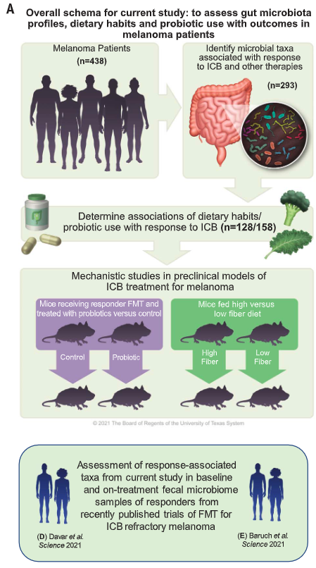

# Metadata from SPENDER et al
Paper info:
Title: Dietary fiber and probiotics influence the gut microbiome and melanoma immunotherapy response
DOI: https://www.science.org/doi/10.1126/science.aaz7015

## Is there any _clinical_ annotation from patients?

There is evidence of patient-level annotation in the paper based on summary tables, but there is no public access to patient-level data.

Clinical data include

* RECIST 1.1 values
* Clinician classification of R/NR based on CT values and RECITS 1.1 data
* TMB
* PD-L1 staining value (binary: <1% >1%)

Response (R) was defined by radiographic evidence of complete response, partial response or stable disease (for at least 6 months) per RECIST 1.1 criteria. 
Lack of a clinical response (non-responder, NR) was defined by disease progression (PD) on serial CT scans or stable disease lasting less than 6 months. Progression-free survival (PFS) was defined as the interval of time from treatment start to treatment progression (via scans or clinically determined) or the date of death. Otherwise patients were censored at the time of their last visit to the clinic through September 3, 2020 (date of follow-up assessment).

## Is there presence of any other metadata from the paper?

### FACS

No FACS data on human samples

### Metagenomic

> **Bacterial DNA extraction and 16S rRNA gene sequencing:** Sample preparation and sequencing was performed across the entire melanoma patient cohort (n=438, one sample per patient). The 16S-V4 amplification protocol was adapted from those described in Earth Microbiome Project i.e.,primers 515f/806r (45, 46). Briefly, genomic DNA was extracted using Qiagen/MO BIO PowerMicrobiome DNA isolation kit on automated liquid handlers (Hamilton STARlet instruments). The 16S rRNAgeneV4 region was amplified by PCR and sequenced on the MiSeq platform (Illumina, Inc, San Diego, CA) using the 2x250 bp paired-end protocol yielding paired-end reads with near-complete overlap. The primers used for amplification contain adapters for MiSeq sequencing and single-end barcodes allowing pooling and direct sequencing of PCR products (46).

> **Metagenomic data generation for human studies:**  For the human stool samples, individual sequencing libraries were constructed from each sample then pooled and loaded onto the Illumina HiSeq2000 platform in 200 cycle runs. At CosmosID, extracted DNA from BCM-CMMR (Baylor College of Medicine Alkek Center for Metagenomics and Microbiome Research) were quantified using Qubit4 and individual sequencing libraries were prepared and sequenced on the Illumina NextSeq 550 or HiSeq X platform in two separate 300 cycle runs. Raw FASTQ files were made available through CosmosID client portal.

Metagenomic data acquisition is done by Vastbiome CompTeam

### Human Genetic and RNA-Seq

it appears that MD anderson perfoms a routine WGS on resected tumours to estimate global mutational burden

> **TMB estimation in Lifestyle ICB cohort patients:** Data from targeted whole genome sequencing performed as part of routine clinical care at MD Anderson was abstracted from the medical record when available. Predicted tumor mutational burden (TMB) was derived from targeted whole genome sequencing data as previously described, usingan algorithm which calculates the predicted TMB using the weighted scores of specific genes mutated in a giventumor (44). TMB was classified as either high (≥100) or low (<100) predicted mutations as previously described (44).

> **PD-L1 staining in Lifestyle ICB cohort patients:** For patients with available tumor tissue, tumor PD-L1 was quantified via immunohistochemical studies performed using the FDA approved Dako pharmDx PD-L1 (clone 28-8, Dako/Agilent Technologies, Carpinteria, CA) on Dako Autostainer Link 48 autostainer (Dako/Agilent Technologies, Carpinteria, CA) and antigen retrieval with PT Link with Target Retrieval Solution, low pH (Dako/Agilent Technologies, Carpinteria, CA) as specified by the manufacturer. PD-L1 was classified as ≥1% vs.<1%.

Data could be collected for the TMB classification too, but need to be requested

### scRNA-Seq

not done

### Proteomic

not done

### Metabolomic

not done

